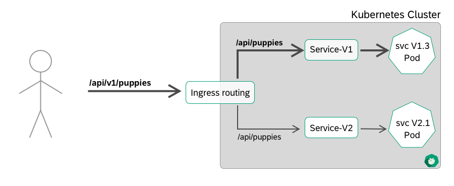

# API Versioning Best Practices
Change is inevitable and growth is a good thing. When your API reaches the point where it expands beyond its 
original purpose and capacity, it's time to consider the next **version**. 

Whether the next iteration is an major version or just a feature extension, it's important to consider 
the pros and cons of informing your developers about it. Unlike traditional software versioning, API 
versioning can have significant effects on the products it uses downstream.

## One URI to Rule Them All
One school of thought is to focus on one unchanging URI with just one set of criteria for consumption. 
If the API structure is changed, resources altered, or parameter set modified, then the product is 
re-launched with the same URI. **This pushes the obligation to refactor code to downstream developers.**
This approach is not particularly easy to use in a world dominated by microservices.

## Semantic Versioning in the URI
What can we learn from the versioning practices of established web API providers? 
[Google](https://cloud.google.com/apis/design/versioning) comes out of the gate with a blunt affirmation 
of numbered versioning: **Networked APIs should use Semantic Versioning.**




Which approach is now called **Best Practices** has evolved over time and is also shaped by the choice of 
platform. When it comes to choosing an approach for versioning a HTTP REST interface, Kubernetes uses the 
approach of encoding it in the URL. If you wonder - kubernetes is strongly influenced by Google and here 
URI encoding was nominated as **best practice**.

*Example REST enpoints in a kubernetes cluster:*

```
elasticsearch-logging is running at https://104.197.5.247/api/v1/namespaces/kube-system/services/elasticsearch-logging/proxy
kibana-logging is running at https://104.197.5.247/api/v1/namespaces/kube-system/services/kibana-logging/proxy
kube-dns is running at https://104.197.5.247/api/v1/namespaces/kube-system/services/kube-dns/proxy
grafana is running at https://104.197.5.247/api/v1/namespaces/kube-system/services/monitoring-grafana/proxy
heapster is running at https://104.197.5.247/api/v1/namespaces/kube-system/services/monitoring-heapster/proxy
```


**So if you want to go this way, Kubernetes offers excellent support to version your API endpoints and you are able to 
run your services in different versions separately.**

## Must Take Care
Your API mustn't support too much versions

 - messy code or too much branches
 - Bugfix double maintenance 
 - support of lazy clients which never update an API and thus provoke errors and make them exist longer than necessary
 - It becomes difficult to maintain the common DB persistence for all API versions.

# Enough of the long preamble...here comes the technical part.

All the work of filtering and controlling the API calls is done completely in the Ingress Definition. No additional 
code in the backend is necessary.

```YAML
apiVersion: extensions/v1beta1
kind: Ingress
metadata:
  name: api-ingress
  annotations:
    nginx.ingress.kubernetes.io/rewrite-target: /api/$1
spec:
  rules:
  - host: api.ingress.<GARDENER-CLUSTER>.<GARDENER-PROJECT>.shoot.canary.k8s-hana.ondemand.com
    http:
      paths:
      - path: /api/v1/(.*)$ #everything after "api/v1/" will be send as a parameter to the rewrite-target
        backend:
          serviceName: v1api-svc
          servicePort: 80
      - path: /api/v2/(.*)$ #everything after "/api/v2/" will be send as a parameter to the rewrite-target
        backend:
          serviceName: v2api-svc
          servicePort: 80
```

As you may quickly see, a bit of RegEx magic is used here to process the path according to the service and 
remove the **version** portion before forwarding.

The URL in the backend pod didn't have this version information in the URL. It's ust clean and pure REST.

You can clone this repository and inspect the files in the `yaml/*` directory you the complet routing is working.
